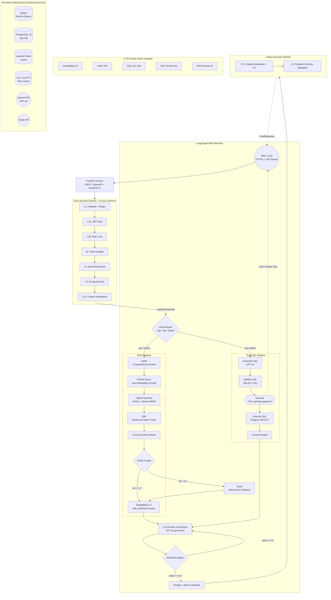

# Enterprise Advanced RAG

Build a production-grade Enterprise RAG system for Kubernetes IT operations using LangGraph, FastAPI, Qdrant, PostgreSQL, Redis caching, and advanced retrieval patterns. This repository evolves from a baseline RAG into a highly advanced system featuring Hybrid Search, ReRanking, HyDE, CRAG, Self-RAG, Text2SQL with human approval, comprehensive evaluation, and a 9-layer guardrails pipeline.

## 🚀 Features & Architecture



The system is built on a robust, state-of-the-art AI stack:

### 1. LangGraph State Machine
Orchestrates the entire flow using a Postgres-checkpointed state machine with conditional edges and human-in-the-loop (HITL) interrupts.
- **Intent Router**: Dynamically routes queries between `rag`, `sql`, and `hybrid` workflows.

### 2. Advanced RAG Pipeline
- **HyDE (Hypothetical Document Embeddings)**: Generates 3 hypothetical answers to bridge vocabulary gaps.
- **Embed Query**: Utilizes `text-embedding-3-small` for dense representations.
- **Hybrid Retrieval**: Combines Dense vectors and Sparse BM25 keywords in Qdrant.
- **RRF (Reciprocal Rank Fusion)**: Fuses dense and sparse results (k=60).
- **Cross-Encoder Reranking**: Uses MS-MARCO MiniLM / BGE to rerank the top chunks for 100x precision.
- **CRAG (Corrective RAG)**: Grades retrieval relevance. If relevance < 0.7, falls back to **Tavily Web Search**.
- **Spotlighting**: Uses XML-delimited chunks to resist prompt injection and maintain context grounding.
- **Self-RAG Reflection**: Evaluates the final generated answer. If the score < 0.8, it triggers a regeneration (up to max 2 retries).

### 3. Text2SQL Pipeline
- **Generate SQL**: Uses schema-aware GPT-4o to translate Natural Language to SQL.
- **Validate SQL**: strict `SELECT`-only blocklist verification.
- **Human-in-the-Loop (HITL)**: `interrupt()` halts execution until a user manually approves the SQL.
- **Execute & Format**: Runs safely against PostgreSQL and formats rows into context for the LLM.

### 4. 9-Layer Defense-in-Depth Security Pipeline
Protects both the input request and output response:
- **L1**: Pydantic + Regex injection patterns
- **L2**: llm-guard Scan (Prompt Injection / Toxicity)
- **L4a**: JWT Auth
- **L4b**: Rate Limiting (20 req / min)
- **L5**: Input Restructure (tiktoken truncation)
- **L6**: Token Budget (100k / day / user)
- **L7a/b**: Content Moderation & PII Redaction
- **L8**: Spotlighting (XML isolation)
- **L9**: Pydantic Schema Validation (Retries on LLM schema failures)

### 5. 5-Tier Redis Cache (Upstash)
Wraps expensive LLM/DB calls with distinct TTLs to drastically reduce latency and costs:
- `Embedding` (7d)
- `Intent Router` (24h)
- `SQL Gen` (24h)
- `SQL Result` (15m)
- `RAG Answer` (1h)

### 6. Persistent Data Stores
- **Qdrant**: Dense + Sparse vector storage (~10k chunks).
- **PostgreSQL 16**: Ops Database (7 tables for clusters/pods/incidents) + LangGraph Checkpoints.
- **Upstash Redis**: Serverless cache.
- **OpenAI API**: GPT-4o + Embeddings.
- **Tavily API**: Web search fallback.

---

## 🛠️ Installation & Setup

### Prerequisites
- Python 3.12+
- Node.js 18+ & npm (for the frontend)
- Docker & Docker Compose (for PostgreSQL and Qdrant)

### 1. Clone the repository
```bash
git clone https://github.com/prosws2210/Enterprise-RAG.git
cd Enterprise-RAG
```

### 2. Set up Environment Variables
Copy the example environment file and fill in your API keys:
```bash
cp .env.example .env
```
Ensure you provide:
- `OPENAI_API_KEY`
- `GROQ_API_KEY`
- `TAVILY_API_KEY`
- Redis/Upstash credentials
- Database URLs (Local defaults are provided in `.env.example`)

### 3. Start the Backend Infrastructure
Use Docker Compose to spin up PostgreSQL and Qdrant locally:
```bash
docker-compose up -d
```

### 4. Set up the Python Backend
We recommend using a virtual environment (`venv` or `uv`):
```bash
cd backend
python -m venv .venv
source .venv/bin/activate  # On Windows: .venv\Scripts\activate
pip install -r requirements.txt
```

Initialize and seed the databases:
```bash
python scripts/seed_db.py
```

Start the FastAPI Server:
```bash
python scripts/serve.py
```
*The API will be available at `http://localhost:8000`*

### 5. Start the React Frontend
Open a new terminal window:
```bash
cd frontend
npm install
npm run dev
```
*The beautifully redesigned UI will be available at `http://localhost:5173`*

---

## 💻 Usage

1. **Authentication**: Create an account or log in through the futuristic Glassmorphism interface.
2. **Knowledge Base**: Navigate to the Documents page to drag-and-drop PDFs. They will be automatically parsed, chunked, embedded, and pushed to Qdrant.
3. **Chat**: Ask complex Kubernetes IT operations questions. Watch the pipeline route between standard RAG and Text2SQL.
4. **Human-in-the-Loop**: If you trigger a database query (Text2SQL), the system will pause and ask for your explicit approval before executing the query against Postgres.
5. **System Dashboard**: Monitor the live health of all infrastructure (Qdrant, Redis, Postgres) directly from the System Status page.
6. **Evaluation Dashboard**: View RAGAS evaluation metrics (Faithfulness, Precision, Recall, Relevancy) for your deployment.

## 🤝 Contributing
Contributions are welcome! Please ensure you test your changes against the RAGAS evaluation pipeline before submitting a pull request.
